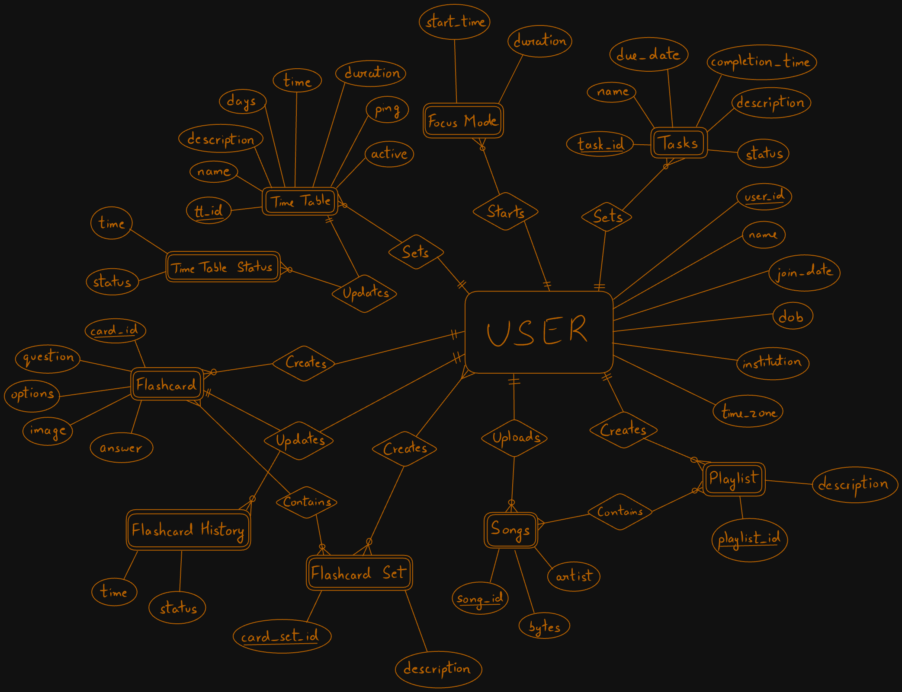

# Study Tracker Discord Bot

 **GitHub Repo Link** : https://github.com/ShaunAlanJoseph/Study-Tracker-Discord-Bot
 <br>
 **Link to Presentation** : https://www.canva.com/design/DAGUIOzmkGQ/RUpkwpSAyH1X3Y_wdKFkxQ/view?utm_content=DAGUIOzmkGQ&utm_campaign=designshare&utm_medium=link&utm_source=editor

## 1. Project Planning

### Project Title:
Study Tracker Discord Bot

### Define Objectives:
The objective of the Study Tracker Discord Bot is to help users manage their study schedules, tasks, and focus modes through a Discord bot interface. The system should allow users to create and manage tasks, track their study time, and maintain playlists for study sessions.

## 2. Requirement Analysis

### System Specification:
- **Functional Requirements:**
  - Users should be able to create, read, update, and delete tasks and time tables.
  - Users should be able to start and stop focus modes.
  - Users should be able to create and manage playlists and songs.
  - The bot should provide reminders and notifications for tasks and focus modes.
  - The bot should maintain a history of completed tasks, time tables and focus sessions.

- **Non-Functional Requirements:**
  - **Performance:** The system should handle multiple users and concurrent operations efficiently.
  - **Security:** User data should be securely stored and accessed.

### Data Requirements:
- **Types of Data:**
  - User information (user_id, username, join_date)
  - Tasks (task_id, user_id, name, description, status, due_date, completion_time)
  - Time_Table (tt_id, user_id, name, description, days, time, duration, ping, active)
  - Focus modes (user_id, start, duration, status)
  - Playlists (playlist_id, user_id)
  - Songs (song_id, bytes, artist)
  - Card sets and cards for study materials

- **Relationships:**
  - Users have multiple tasks, focus modes, playlists, and card sets.
  - Playlists contain multiple songs.
  - Card sets contain multiple cards.

- **Constraints:**
  - Primary keys and foreign keys to maintain data integrity.
  - Unique constraints on user_id, task_id, playlist_id, and song_id,tt_id.

## 3. Database Design

### Conceptual Design:
The Entity-Relationship (ER) diagram visualizes the entities, attributes, and relationships. Here is a textual representation based on the provided context:

- **Users** (user_id (PK), username, join_date)
  - (1:N) Tasks (task_id (PK), user_id (FK), name, description, status, due_date, completion_time)
  - (1:N) TimeTableEntry (tt_id (PK), user_id (FK), name, description, days, time, duration, ping)
    - (1:N) TimeTableCompletedEntries (tt_id (FK), time, status)
  - (1:1) FocusMode (user_id (FK), start, duration, status)
  - (1:N) Playlist (playlist_id (PK), user_id (FK))
    - (1:N) SongEntry (playlist_id (FK), song_id)
      - (N:1) Songs (song_id (PK), bytes, artist)
  - (1:N) CardSet (card_set_id (PK), user_id (FK))
    - (1:N) CardEntry (card_set_id (FK), card_id)
      - (N:1) Cards (card_id (PK), question, answer, card_type)
        - (1:1) DropdownCards (card_id (FK), option)
    <br>
### ER Overview:
```plaintext
Users (user_id (PK), username, join_date) // Strong Entity
    |
    |<-- (1:N) -- Tasks (task_id (PK), user_id (FK), name, description, status, due_date, completion_time) // Strong Entity
    |
    |<-- (1:N) -- TimeTableEntry (tt_id (PK), user_id (FK), name, description, days, time, duration, ping) // Strong Entity
    |                |
    |                |<-- (1:N) -- TimeTableCompletedEntries (tt_id (FK), time, status) // Weak Entity
    |
    |<-- (1:N) -- FocusMode (user_id (FK), start, duration) // Weak Entity
    |
    |<-- (1:N) -- Playlist (playlist_id (PK), user_id (FK)) // Strong Entity
    |                |
    |                |<-- (1:N) -- SongEntry (playlist_id (FK), song_id) // Junction table for m:n relations. Represent this as a m:n relation
    |                                |
    |                                |<-- (N:1) -- Songs (song_id (PK), bytes, artist) // Strong Entity
    |
    |   
    | 
    |<-- (1:N) -- CardSet (card_set_id (PK), user_id (FK)) // Strong Entity
    |               |
                    |<-- (1:N) -- CardEntry (card_set_id (FK), card_id) // Junction table for m:n relations. Represent this as a m:n relation
                                    |
                                    |<-- (N:1) -- Cards (card_id (PK), question, answer, card_type) // Strong Entity
                                                    |
                                                    |<-- (1:1) -- DropdownCards (card_id (FK), option) // Weak Entity
                                                    |
                                                    |<-- (1:N) -- CardHistory (card_id (FK), time, status) // Weak Entity
```

 
  
### ER Diagram:




### Logical Design:
Convert the ER diagram into a relational schema:

- **Users**:
  ```sql
  CREATE TABLE Users (
      user_id BIGINT PRIMARY KEY,
      name VARCHAR(64) NOT NULL,
      join_date BIGINT NOT NULL,
      dob BIGINT,
      institution VARCHAR(256),
      time_zone SMALLINT
  );
  ```

- **Tasks**:
  ```sql
  CREATE TABLE Tasks (
      task_id SERIAL PRIMARY KEY,
      user_id BIGINT NOT NULL,
      name VARCHAR(128) NOT NULL,
      description TEXT,
      status VARCHAR(32),
      due_date BIGINT,
      completion_time BIGINT,
      FOREIGN KEY (user_id) REFERENCES Users(user_id)
  );
  ```

- **Time_Table**:
  ```sql
  CREATE TABLE Time_Table (
      tt_id VARCHAR(12) PRIMARY KEY,
      user_id BIGINT NOT NULL,
      name VARCHAR(128) NOT NULL,
      description TEXT,
      days SMALLINT NOT NULL,
      time SMALLINT NOT NULL,
      duration SMALLINT,
      ping BOOLEAN NOT NULL,
      active BOOLEAN NOT NULL,
      FOREIGN KEY (user_id) REFERENCES Users(user_id)
  );
  ```

- **Time_Table_Status**:
  ```sql
  CREATE TABLE Time_Table_Status (
      tt_id VARCHAR(12) NOT NULL,
      time BIGINT NOT NULL,
      status VARCHAR(32),
      PRIMARY KEY (tt_id, time),
      FOREIGN KEY (tt_id) REFERENCES Time_Table(tt_id)
  );
  ```

- **Focus_Mode**:
  ```sql
  CREATE TABLE Focus_Mode (
      user_id BIGINT,
      start_time BIGINT NOT NULL,
      duration BIGINT NOT NULL,
      PRIMARY KEY (user_id, start_time),
      FOREIGN KEY (user_id) REFERENCES Users(user_id)
  );
  ```

- **Songs**:
  ```sql
  CREATE TABLE Songs (
      song_id VARCHAR(12) PRIMARY KEY,
      user_id BIGINT NOT NULL,
      name VARCHAR(128) NOT NULL,
      bytes BYTEA NOT NULL,
      artist VARCHAR(64) NOT NULL,
      FOREIGN KEY (user_id) REFERENCES Users(user_id)
  );
  ```

- **Playlist**:
  ```sql
  CREATE TABLE Playlist (
      playlist_id VARCHAR(12) PRIMARY KEY,
      user_id BIGINT NOT NULL,
      name VARCHAR(128) NOT NULL,
      FOREIGN KEY (user_id) REFERENCES Users(user_id)
  );
  ```

- **Playlist_Songs**:
  ```sql
  CREATE TABLE Playlist_Songs (
      playlist_id VARCHAR(12),
      song_id VARCHAR(12),
      PRIMARY KEY (playlist_id, song_id),
      FOREIGN KEY (playlist_id) REFERENCES Playlist(playlist_id),
      FOREIGN KEY (song_id) REFERENCES Songs(song_id)
  );
  ```

- **Flashcard**:
  ```sql
  CREATE TABLE Flashcard (
      card_id VARCHAR(12) PRIMARY KEY,
      user_id BIGINT NOT NULL,
      question TEXT NOT NULL,
      options TEXT[],
      answer TEXT,
      image BYTEA,
      FOREIGN KEY (user_id) REFERENCES Users(user_id)
  );
  ```

- **Flashcard_Set**:
  ```sql
  CREATE TABLE Flashcard_Set (
      card_set_id VARCHAR(12) PRIMARY KEY,
      name VARCHAR(128) NOT NULL,
      owner BIGINT NOT NULL,
      description TEXT,
      FOREIGN KEY (owner) REFERENCES Users(user_id)
  );
  ```

- **Flashcard_set_access**:
  ```sql
  CREATE TABLE Flashcard_set_access (
      card_set_id VARCHAR(12),
      user_id BIGINT,
      PRIMARY KEY (card_set_id, user_id),
      FOREIGN KEY (card_set_id) REFERENCES Flashcard_Set(card_set_id),
      FOREIGN KEY (user_id) REFERENCES Users(user_id)
  );
  ```

- **Flashcard_Set_Cards**:
  ```sql
  CREATE TABLE Flashcard_Set_Cards (
      card_set_id VARCHAR(12),
      card_id VARCHAR(12),
      added_by BIGINT NOT NULL,
      PRIMARY KEY (card_set_id, card_id),
      FOREIGN KEY (card_set_id) REFERENCES Flashcard_Set(card_set_id),
      FOREIGN KEY (card_id) REFERENCES Flashcard(card_id)
  );
  ```

- **Flashcard_History**:
  ```sql
  CREATE TABLE Flashcard_History (
      card_id VARCHAR(12),
      user_id BIGINT,
      time BIGINT,
      correct BOOLEAN,
      PRIMARY KEY (card_id, user_id, time),
      FOREIGN KEY (card_id) REFERENCES Flashcard(card_id),
      FOREIGN KEY (user_id) REFERENCES Users(user_id)
  );
  ```


### Normalization:
The database is normalized up to the third normal form (3NF) to reduce redundancy and improve integrity.

## 4. Implementation

### Database Creation:
The database and tables are created using SQL queries as shown in the logical design section.

### Coding:

### Tasks
```sql
-- Create
INSERT INTO Tasks (task_id, user_id, name, description, status, due_date, completion_time) VALUES (?, ?, ?, ?, ?, ?, ?);

-- Read
SELECT * FROM Tasks WHERE user_id = ?;

-- Update
UPDATE Tasks SET name = ?, description = ?, status = ?, due_date = ?, completion_time = ? WHERE task_id = ?;

-- Delete
DELETE FROM Tasks WHERE task_id = ?;
```

### Time Tables

```sql
-- Create
INSERT INTO TimeTables (tt_id, name, time, days, duration, description) VALUES (?, ?, ?, ?, ?, ?);

-- Read
SELECT * FROM TimeTables WHERE tt_id = ?;

-- Update
UPDATE TimeTables SET name = ?, time = ?, days = ?, duration = ?, description = ? WHERE tt_id = ?;

-- Delete
DELETE FROM TimeTables WHERE tt_id = ?;
```

### Songs

```sql
-- Create
INSERT INTO Songs (song_id, name, artist, audio_file) VALUES (?, ?, ?, ?);

-- Read
SELECT * FROM Songs WHERE song_id = ?;

-- Update
UPDATE Songs SET name = ?, artist = ?, audio_file = ? WHERE song_id = ?;

-- Delete
DELETE FROM Songs WHERE song_id = ?;
```

### Flash Cards

```sql
-- Create
INSERT INTO FlashCards (card_id, question, answer, option1, option2, option3) VALUES (?, ?, ?, ?, ?, ?);

-- Read
SELECT * FROM FlashCards WHERE card_id = ?;

-- Update
UPDATE FlashCards SET question = ?, answer = ?, option1 = ?, option2 = ?, option3 = ? WHERE card_id = ?;

-- Delete
DELETE FROM FlashCards WHERE card_id = ?;
```
### User Registration

```sql
-- Create
INSERT INTO Users (user_id, name, institution, dob) VALUES (?, ?, ?, ?);

-- Read
SELECT * FROM Users WHERE user_id = ?;

-- Update
UPDATE Users SET name = ?, institution = ?, dob = ? WHERE user_id = ?;

-- Delete
DELETE FROM Users WHERE user_id = ?;
```


However in this project these operations are performed internally by discord through the python functions we have written

 

### User Interface (UI) Design:
  For this project, the UI is implemented as a Discord bot using the `discord.py` python library.


### Technologies Used 

**Front End**:
 - Using discord.py and discord
 **Back End**:
 - Using pyscop2.py, a PostgreSQL  framework for python
 **API**:
 - Gemini Flash 1.5  API along with google.genai module in python
 **Python requirements.txt File**:
```txt
python-dotenv

discord

discord.py

psycopg2

google-generativeai

python-dateutil
 
```


## 5. Testing and Validation

### Test Cases:
- **Task Management:**
  - Create a task and verify it appears in the database.
  - Update a task and check if changes are reflected.
  - Delete a task and ensure it is removed from the database.
  - Retrieve tasks for a user and ensure correct data is fetched.

- **Focus Mode:**
  - Start a focus mode session and check if it's recorded.
  - End a focus mode session and verify if the status is updated.

- **Playlist Management:**
  - Create a playlist and add songs, then verify through fetching.
  - Update playlist details and check for changes.
  - Delete a playlist and ensure all related songs are also handled.

- **Notifications and Reminders:**
  - Set a reminder for a task and check if the notification is triggered at the right time.
  - Start a focus mode and verify if a reminder is sent when the session is about to end.

### Validation:
- **Functional Validation:**  All functionalities such as task creation, updating, deletion, and notifications work as intended.
- **Performance Validation:** The bot handles multiple users and concurrent operations efficiently.
- **Security Validation:** The data is securely handled with user verification.

## 6. User Manual

### Set Up
**Go to our GitHub at https://github.com/ShaunAlanJoseph/Study-Tracker-Discord-Bot and follow the set up instructions**

### Prerequisites

- Python 3.6 or higher
- A Discord account
- Access to the [Discord Developer Portal](https://discord.com/developers/applications) to create a bot
- Gemini API access

### Installation

1. **Clone the repository:**

   ```bash
   git clone https://github.com/ShaunAlanJoseph/Study-Tracker-Discord-Bot.git
   ```

2. **Install Dependancies:**
```bash
pip install -r requirements.txt
```
3.  **Create a `.env` file in the root directory of the project and add the following lines:**
```
DISCORD_API_TOKEN=<Your_Discord_Bot_Token>
Gemini_API_Key=<Your_Gemini_API_Key>


ADMIN_CHANNEL_ID=<admin channel id>

DB_URL=<postgres db url>

DB_PORT=<postgres port>

DB_NAME=<your database name>

DB_USER=<your username>

DB_PASS=<your password>


```

4. **Run the bot:**
```bash
python bot.py
```

### Using the bot
- Command prefix is $
- Write !help to ask Gemini AI for help regarding any of the commands .Alternatively you can use $help to see a list of available commands


### Study Tracker Commands

```
Below is the list of available commands

Study Tracker Commands

Flashcard Commands

- $add_flashcard

    {message}

  Adds a new flashcard. Message format should be

# Q: <question 256 chars>

## A: <answer 256 chars>

- <option1 256 chars>

- <option2 256 chars>

- <option3>

  

- $list_flashcards  

  Lists all flashcards. No arguments required.

- $flashcard_flash {card_id}  

  Flashes a specific flashcard by ID. Takes one argument: card_id.

- $flashcard_create_set {set_name}

  Creates a new flashcard set. Takes one argument: <set_name>

- $flashcard_add_to_set {set_id} {card_id}

  Adds a flashcard to a set by ID. Takes two arguments: set_id, card_id.

- $flashcard_remove_from_set {set_id} {card_id}

  Removes a flashcard from a set by ID. Takes two arguments: set_id, card_id.

- $flashcard_review_set {set_id}

  Reviews a flashcard set by ID. Takes one argument: set_id.

  

Task Management Commands

- $add_task {name}  

  Adds a new task with a specified name. Takes one argument: name.

- $set_task {name}  

  Sets the current task by name. Takes one argument: name.

- $set_task_by_id {id}  

  Sets the current task by ID. Takes one argument: id.

- $add_description {description}  

  Adds a description to the current task. Takes one argument: description.

- $list_tasks  

  Lists all tasks. No arguments required.

- $remove_task {name}  

  Removes a task by name. Takes one argument: name.

- $delete_task {id}  

  Deletes a task by ID. Takes one argument: id.Also called task number

- $mark_as_done {name}  

  Marks a task as done by name. Takes one argument: name.

- $mark_as_started {name}  

  Marks a task as started by name. Takes one argument: name.

- $mark_as_started_by_id {id}  

  Marks a task as started by ID. Takes one argument: id.

- $mark_as_done_by_id {id}  

  Marks a task as done by ID. Takes one argument: id.

- $set_due_date {due_date}  

  Sets a due date for the current task. Takes one argument: due_date (format: YYYY-MM-DD HH:MM:SS).

  

Music Commands

- $add_song {message}  

  Adds a new song. Message format should be 'Song Name by Artist.

  For example: despacito by justin bieber

  An attachment containing an audio file(mp3) should be sent with the message

- $get_song {song_id}  

  Retrieves a song by ID. Takes one argument: song_id.

- $create_playlist {playlist name}  

  Creates a new playlist. Takes the name of the playlist.

- $get_playlist {playlist_id}  

  Retrieves a playlist by ID. Takes one argument: playlist_id.

- $add_song_to_playlist {playlist_id} {song_id}  

  Adds a song to a playlist by song ID and playlist ID. Takes two arguments: playlist_id, song_id.

- $remove_song_from_playlist {playlist_id} {song_id}  

  Removes a song from a playlist by song ID and playlist ID. Takes two arguments: playlist_id, song_id.

- $play_playlist {playlist_id}  

  Plays a playlist by ID. Takes one argument: playlist_id.

  

Time Table Management Commands

- $create_time_table_entry {message}

  Adds a new time table entry. Message format should be

  # name: <name>

  ## time: <time>

  ## days: <days>

  ## duration: <duration>(an integer in minutes)

  - description: <description>

-$delete_time_table_entry {tt_id}

  Removes a time table entry by ID. Takes one argument: tt_id.

  
  

General Purpose Commands

- $ping  

  Responds with 'Pong!' and alternates messages. No arguments required.

- $query {question}  

  Queries the Gemini API with your question and returns a response. Takes one argument: question.

- $pm  

  Sends a private message to you asking how the bot can help and you can talk to it. No arguments required.

- $gemini enable  

  Enables Gemini to respond to every message in the server. No arguments required.

- $gemini disable  

  Disables Gemini from responding to every message in the server. No arguments required.

- $register {name}  

  Registers a new user. Takes the name of the user

- $set_institution {institution}

  Sets the institution of the user. Takes the name of the institution

- $set_dob {dob}

  Sets the date of birth of the user. Takes the date of birth in the format DD MM YYYY

- !help {question}  

  To ask a question related to the commands to the bot. Takes one optional argument: question.
```

## 7) Documentation

**Below is our GitHub commit history documenting the process of our work**.

**You can also find all the information about our project at** https://github.com/ShaunAlanJoseph/Study-Tracker-Discord-Bot

### Commits on Sep 9, 2024

- **Delete .vscode directory**  
  *E-m-i-n-e-n-c-e authored on Sep 9*  
  *Verified*

- **Added .vscode to git ignore**  
  *E-m-i-n-e-n-c-e committed on Sep 9*

- **setup the bot**  
  *ShaunAlanJoseph committed on Sep 9*

### Commits on Sep 10, 2024

- **added: queries for creating tables**  
  *Venkat-jaswanth committed on Sep 10*

- **added: utils**  
  *ShaunAlanJoseph committed on Sep 10*

- **added: construct_db.py**  
  *ShaunAlanJoseph committed on Sep 10*

- **Merge branch 'main' of https://github.com/ShaunAlanJoseph/Study-Tracker-Discord-Bot**  
  *ShaunAlanJoseph committed on Sep 10*

- **added: database class**  
  *ShaunAlanJoseph committed on Sep 10*

### Commits on Sep 11, 2024

- **Update README.md**  
  *E-m-i-n-e-n-c-e authored on Sep 11*  
  *Verified*

- **Merge branches 'main' and 'main' of https://github.com/ShaunAlanJoseph/Study-Tracker-Discord-Bot**  
  *Venkat-jaswanth committed on Sep 11*

- **update: table construction**  
  *Venkat-jaswanth committed on Sep 11*

- **Added image folder and er img>**  
  *E-m-i-n-e-n-c-e committed on Sep 11*

- **Update README.md**  
  *E-m-i-n-e-n-c-e authored on Sep 11*  
  *Verified*

- **Update README.md**  
  *E-m-i-n-e-n-c-e authored on Sep 11*  
  *Verified*

### Commits on Oct 1, 2024

- **Merge branch 'main' of https://github.com/ShaunAlanJoseph/Study-Tracker-Discord-Bot**  
  *E-m-i-n-e-n-c-e committed 3 weeks ago*

- **a**  
  *E-m-i-n-e-n-c-e committed 3 weeks ago*

### Commits on Oct 14, 2024

- **The bot now retries the prompt if there is a server side error from gemini**  
  *E-m-i-n-e-n-c-e committed last week*

- **Added GeminiCog**  
  *E-m-i-n-e-n-c-e committed last week*

- **added send_message**  
  *ShaunAlanJoseph committed last week*

- **added context_manager**  
  *ShaunAlanJoseph committed last week*

### Commits on Oct 15, 2024

- **Merge branch 'main' of https://github.com/ShaunAlanJoseph/Study-Tracker-Discord-Bot**  
  *ShaunAlanJoseph committed last week*

- **added BaseView**  
  *ShaunAlanJoseph committed last week*

### Commits on Oct 16, 2024

- **Added Tasks**  
  *E-m-i-n-e-n-c-e committed last week*

- **added flashcards**  
  *ShaunAlanJoseph committed last week*

### Commits on Oct 17, 2024

- **Fixed another error**  
  *E-m-i-n-e-n-c-e committed last week*

- **Fixed a small error**  
  *E-m-i-n-e-n-c-e committed last week*

### Commits on Oct 18, 2024

- **More gemini stuff**  
  *E-m-i-n-e-n-c-e committed 5 days ago*

### Commits on Oct 22, 2024

- **Merge branch 'main' of https://github.com/ShaunAlanJoseph/Study-Tracker-Discord-Bot**  
  *ShaunAlanJoseph committed 12 hours ago*

- **added time table**  
  *ShaunAlanJoseph committed 12 hours ago*

- **a**  
  *E-m-i-n-e-n-c-e committed 16 hours ago*

- **Merge branch 'main' of https://github.com/ShaunAlanJoseph/Study-Tracker-Discord-Bot**  
  *ShaunAlanJoseph committed 17 hours ago*

- **added songs**  
  *ShaunAlanJoseph committed 17 hours ago*

- **Update README.md**  
  *E-m-i-n-e-n-c-e authored 18 hours ago*  
  *Verified*

- **added flashcard sets**  
  *ShaunAlanJoseph committed 18 hours ago*

- **Merge branch 'main' of https://github.com/ShaunAlanJoseph/Study-Tracker-Discord-Bot**  
  *ShaunAlanJoseph committed yesterday*

- **added flashcards**  
  *ShaunAlanJoseph committed yesterday*

### Commits on Oct 23, 2024

- **Added more commands to the AI's context**  
  *E-m-i-n-e-n-c-e committed 9 hours ago*

- **Merge**  
  *E-m-i-n-e-n-c-e committed 9 hours ago*

- **Some error handling + Updated Gemini's context to include the new commands**  
  *E-m-i-n-e-n-c-e committed 9 hours ago*


-----------------------------------------------**THE END**----------------------------------------------------

